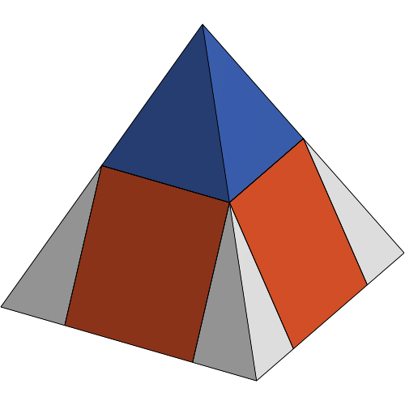
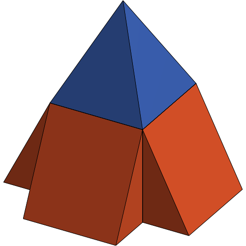
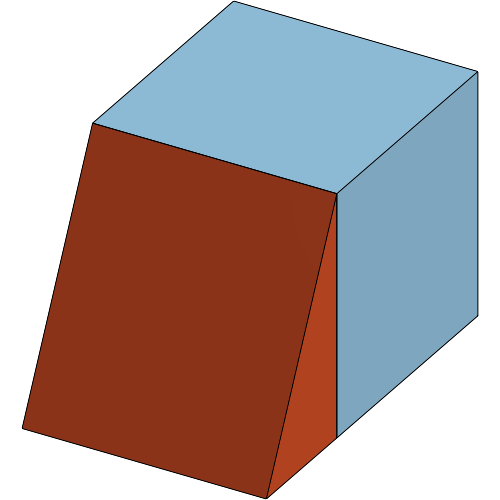

# INTRO *change this section for your own project*
*everything up to the first three dashed lines will always be shown*

# OnShape Pyramid Toy for Child Learning

Many of us learn in school that the volume of a pyramid is equal to the area of its base multiplied by its height divided by three.

But the joy is in discovering where that ratio comes from, and this toy is meant to prove that ratio (a third, as opposed to a half or something else).

---

*Everything below this line will be overwritten/rewritten with next snapshot.*

---

### V6 Full Pyramid Assembly  

### 2026-02-12 03:34:27  

---

### V5 Skew Pyramid Created  

### 2026-02-12 03:21:55  

---

### V4 Assembly of Pyramid Cube and 4 Wedges  

### 2026-02-09 12:05:27  

---

### V3 Top Pyramid  

### 2026-02-09 10:13:58  

---

### V2 Front Wedge Assembly  

### 2026-02-09 05:31:25  

---

### V1 Cube Complete  

### 2026-02-09 04:34:46  

---

### Start  

### 2026-02-09 04:01:40  

---
